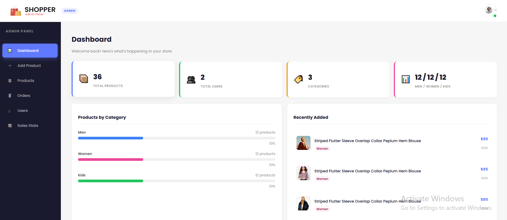
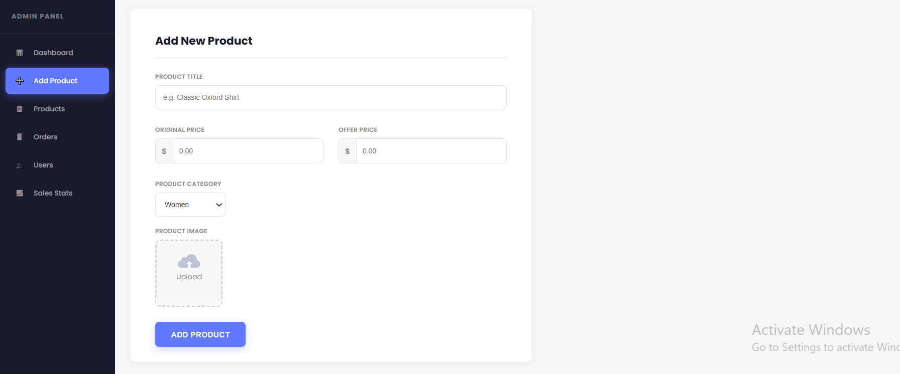
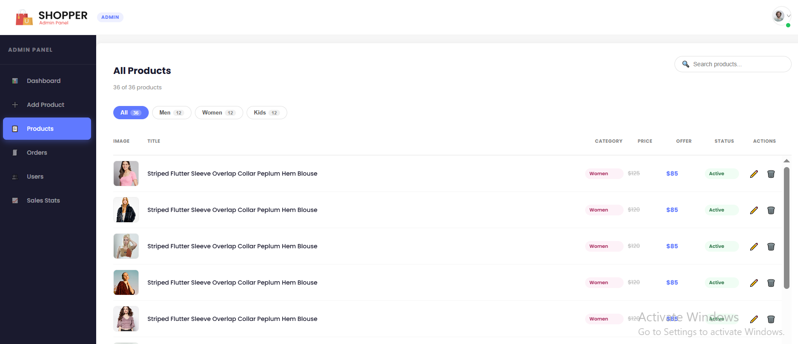
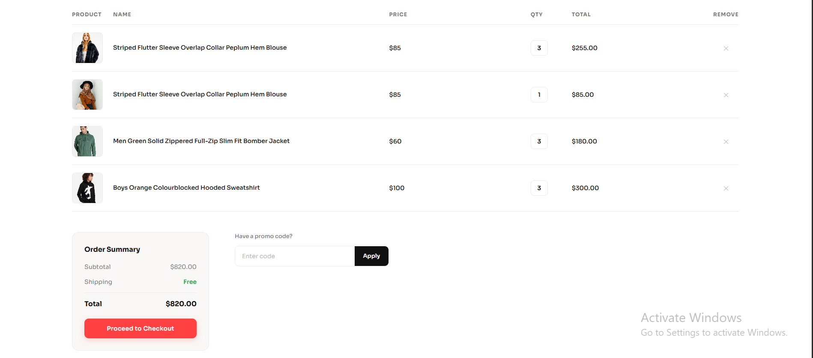
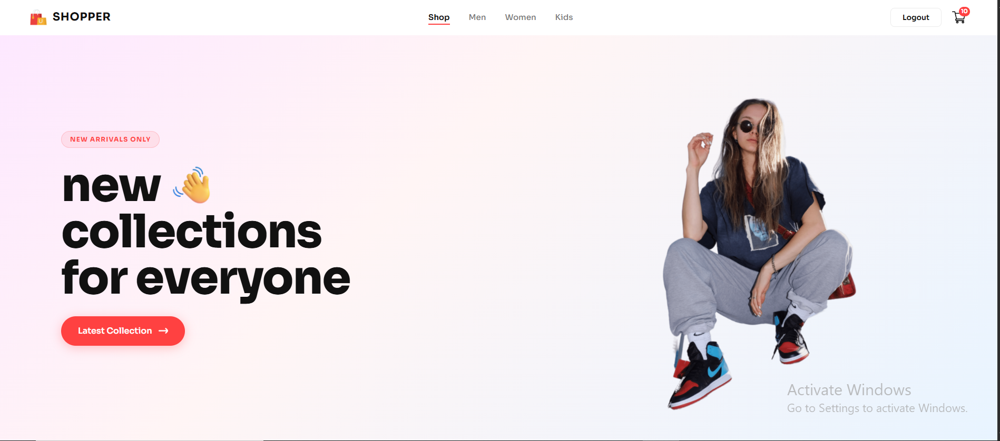
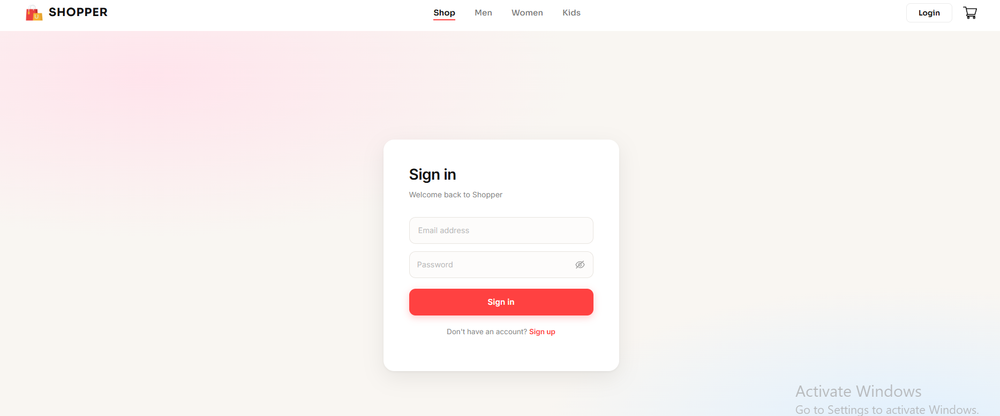
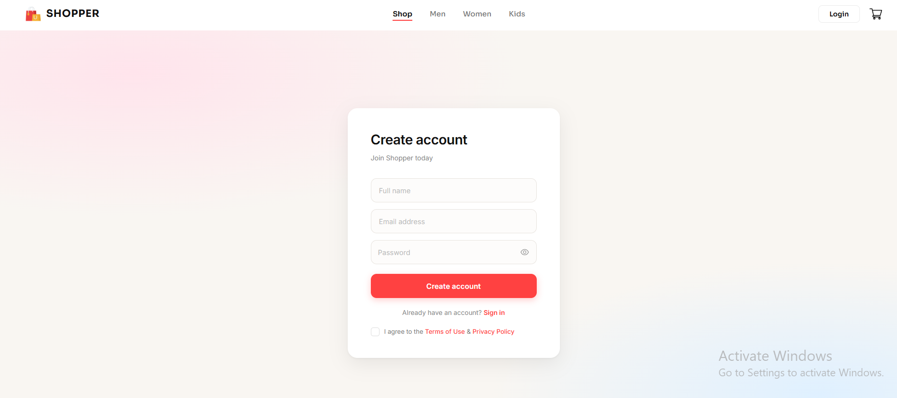
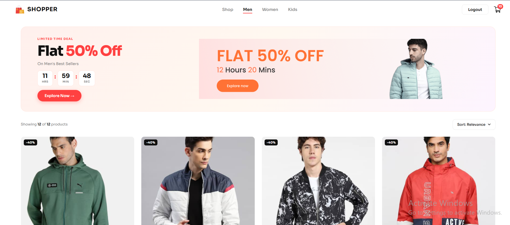
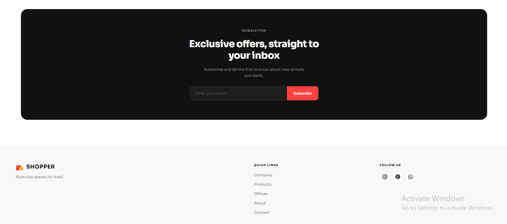

# Shopper — Full Stack E-Commerce App

A full-stack e-commerce web application built with the **MERN stack** (MongoDB, Express, React, Node.js). Includes a customer-facing storefront, an admin panel for managing products, and a secure REST API backend.

---

## Project Structure

```
E-Commerce/
├── backend/        # Node.js + Express REST API
├── frontend/       # React.js customer storefront
└── admin/          # React + Vite admin dashboard
```

---

##  Features

###  Frontend (Customer)
- Browse products by category (Men, Women, Kids)
- Product detail page
- Add to cart / remove from cart
- User signup & login with JWT authentication
- Password visibility toggle
- Responsive design

###  Admin Panel
- Dashboard with product & user stats
- Add new products with image upload
- Edit existing products (name, price, category, image)
- Delete products with confirmation
- Filter products by category
- Pagination (10 products per page)
- Product availability toggle

### Backend API
- RESTful API with Express.js
- MongoDB Atlas database with Mongoose
- Password hashing with bcrypt
- JWT-based authentication
- Input validation with express-validator
- Rate limiting on auth routes
- Security headers with Helmet
- CORS configured for frontend & admin origins
- Image upload with Multer (5MB limit, jpg/png/webp only)

---

## Tech Stack

| Layer     | Technology                              |
|-----------|-----------------------------------------|
| Frontend  | React.js, React Router, Context API     |
| Admin     | React.js, Vite, React Router            |
| Backend   | Node.js, Express.js, ES Modules         |
| Database  | MongoDB Atlas, Mongoose                 |
| Auth      | JSON Web Tokens (JWT), bcrypt           |
| Security  | Helmet, express-rate-limit, CORS        |
| Upload    | Multer                                  |

---

## Getting Started

### Prerequisites
- Node.js v18+
- npm
- MongoDB Atlas account (free tier works)

---

### 1. Clone the repository

```bash
git clone https://github.com/usman-bey-lab/E-Commerce.git
cd E-Commerce
```

---

### 2. Backend Setup

```bash
cd backend
npm install
```

Create a `.env` file inside `/backend`:

```env
PORT=4000
MONGODB_URI=your_mongodb_connection_string
JWT_SECRET=your_strong_random_secret
JWT_EXPIRES_IN=7d
FRONTEND_URL=http://localhost:3000
ADMIN_URL=http://localhost:5173
BASE_URL=http://localhost:4000
```

Start the backend:

```bash
npm run dev       # development (nodemon)
npm start         # production
```

---

### 3. Frontend Setup

```bash
cd frontend
npm install
npm start
```

Runs at **http://localhost:3000**

---

### 4. Admin Panel Setup

```bash
cd admin/vite-project
npm install
npm run dev
```

Runs at **http://localhost:5173**

---

## API Endpoints

### Products
| Method | Endpoint              | Description              |
|--------|-----------------------|--------------------------|
| GET    | `/allproducts`        | Get all products         |
| POST   | `/addproduct`         | Add a new product        |
| POST   | `/removeproduct`      | Delete a product         |
| PUT    | `/editproduct/:id`    | Edit a product           |
| POST   | `/upload`             | Upload product image     |
| GET    | `/newcollection`      | Latest 8 products        |
| GET    | `/popularinwomen`     | Top 4 women's products   |
| GET    | `/adminstats`         | Dashboard statistics     |

### Auth
| Method | Endpoint   | Description        |
|--------|------------|--------------------|
| POST   | `/signup`  | Register new user  |
| POST   | `/login`   | Login user         |

### Cart (requires auth token)
| Method | Endpoint           | Description           |
|--------|--------------------|-----------------------|
| POST   | `/addtocart`       | Add item to cart      |
| POST   | `/removefromcart`  | Remove item from cart |
| POST   | `/getcart`         | Get user's cart       |

---

## Security Features

- Passwords hashed with **bcrypt** (12 salt rounds)
- JWT tokens expire in 7 days
- Rate limiting: max 10 auth attempts per 15 minutes per IP
- HTTP security headers via **Helmet**
- Input validation & sanitization on all routes
- CORS restricted to allowed origins only
- Image uploads restricted by file type and size (5MB max)

---

## Screenshots

### Admin Dashboard


### Admin Add-Product


### Admin Product List


### Cart


### Hero Section


### Login Page


### Signup Page


### Men-Category


### Women-Category


### News Letter



---

## Environment Variables

| Variable       | Description                        |
|----------------|------------------------------------|
| `PORT`         | Server port (default: 4000)        |
| `MONGODB_URI`  | MongoDB Atlas connection string    |
| `JWT_SECRET`   | Secret key for signing JWT tokens  |
| `JWT_EXPIRES_IN` | Token expiry (default: 7d)       |
| `FRONTEND_URL` | Frontend origin for CORS           |
| `ADMIN_URL`    | Admin panel origin for CORS        |
| `BASE_URL`     | Backend base URL for image URLs    |

---

## Important Notes

- Never commit your `.env` file to GitHub — it's in `.gitignore`
- The `upload/images` folder is also gitignored — images are stored locally
- All existing users created before bcrypt was added will need to re-register

---

## Author

**Muhammad Usman Amjad**  
GitHub: [usman-bey-lab](https://github.com/usman-bey-lab)

---

## License

This project is open source and available under the [MIT License](LICENSE).